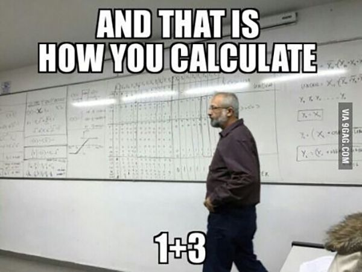

<h1 align="center">Grundlagen der Programmierung</h1>
<h3 align="center">Rechenoperationen</h3>
 

  

### Beschreibung
In dieser Aufgabe werden verschiedene Rechenoperationen und Typkonvertierungen angewendet.

> #### Hinweise zur Bearbeitung
> - Achte darauf, dass dein Quellcode sauber ist. Besonders die Einrückungen sind wichtig!
> - Verwende Dokumentationskommentare, um deinen Code zu erklären und zu dokumentieren.
> - Teste deinen Code. Er sollte nicht nur kompilieren und ausführbar sein, sondern auch das gewünschte Ergebnis liefern.
> - `Commit & Push` dein Ergebnis am Ende des Tages
 

<b>Aufgabe 1 - Zwei Zahlen addieren</b>

  
**Datei für die Aufgabe:** *Aufgabe1.kt*

In dieser Aufgabe sollst du zwei beliebige Zahlen addieren und das Ergebnis ausgeben.

--- 

<b>Aufgabe 2 - Zwei Variablen subtrahieren</b>

**Datei für die Aufgabe:** *Aufgabe2.kt*

In dieser Aufgabe sollst du die zwei gegebenen Variablen subtrahieren. Das Ergebnis soll in der Konsole ausgegeben werden.

---

<b>Aufgabe 3 - Zwei Variablen multiplizieren</b>

**Datei für die Aufgabe:** *Aufgabe3.kt*

In dieser Aufgabe sollst du zwei Variablen vom Typ Integer anlegen und diese multiplizieren. Das Ergebnis soll in einer neuen Variablen gespeichert werden, die im Anschluss auf der Konsole ausgegeben werden soll.

---

<b>Aufgabe 4 - Strings addieren</b>

**Datei für die Aufgabe:** *Aufgabe4.kt*

In dieser Aufgabe sind dir drei Variablen gegeben. Diese repräsentieren jeweils den Tag, den Monat und das Jahr. Gib nun das gesamte Datum mit Hilfe der Variablen auf der Konsole aus. (15. März 2023)

---

<b>Aufgabe 5 - Dividieren</b>

**Datei für die Aufgabe:** *Aufgabe5.kt*

In dieser Aufgabe sind dir bereits zwei Variablen gegeben, die du dividieren sollst. Speichere das Ergebnis in einer neuen Variablen und überlege dir, welcher Datentyp hier passend wäre. Gib das Ergebnis auf der Konsole aus.

---

<b>Aufgabe 6 - Modulo</b>

**Datei für die Aufgabe:** *Aufgabe6.kt*

Gib das Ergebnis & den Rest aus der Division von zahl1 und zahl2 in der Konsole aus. Nutze zur Ausgabe das bereits vorgefertigte print-Statement und ergänze es um das Ergebnis und den Rest.

---

<b>Aufgabe 7 - Verschachtelte Rechenoperationen</b>

### Aufgabe 7.1

**Datei für die Aufgabe:** *Aufgabe7.1.kt*

Speichere folgende Rechnung in einer Variablen und lasse dir das richtige Ergebnis auf der Konsole ausgeben

### Aufgabe 7.2

**Datei für die Aufgabe:** *Aufgabe7.2.kt*

Gib den **Rest** folgender Rechnung auf der Konsole aus.

### Aufgabe 7.3

**Datei für die Aufgabe:** *Aufgabe7.3.kt*

Lege 3 Zahlen an mit den Werten 3.0, 6.0 und 3.14. Speichere in einer **Konstanten** das Ergebnis folgender Rechnung:

Lasse dir nun den **Rest** der Konstanten dividiert mit 2 ausgeben.

---

<b>Aufgabe 8</b>

**Datei für die Aufgabe:** *Aufgabe8.kt*

In dieser Aufgabe findest du bereits die Variable `kg`. Erstelle nun eine neue Variable mit dem Namen `precise_kg` vom Typ Double und speichere in ihr den Wert aus der Variable `kg`. Tue dies mit Hilfe der Typkonvertierung.

---

<b>Aufgabe 9</b>

**Datei für die Aufgabe:** *Aufgabe9.kt*

Hier findest du bereits die Variable `bill` vom Typ `Double`. Erstelle nun eine neue Variable vom Typ `Int` und speichere in ihr den gerundeten Wert aus der Variable `bill`. Tue dies mithilfe der Typkonvertierung. Gib dir die Variable auf der Konsole aus und achte darauf, was dir ausgegeben wird. Wird aufgerundet oder abgerundet?

---

<b>Aufgabe 10</b>

**Datei für die Aufgabe:** *Aufgabe10.kt*

Berechne den Flächeninhalt (F = a * b) und gib ihn auf der Konsole aus.

---

<b>Aufgabe 11</b>

**Datei für die Aufgabe:** *Aufgabe11.kt*

In dieser Aufgabe geht es darum, Geld umzurechnen. Du programmierst einen Geldautomaten, der Euroscheine annimmt und danach deinen Kontostand in Yen (Japanische Währung) anzeigt. Schaue dir hierzu zuerst den bereits vorhandenen Code an und führe ihn aus.

Folge nun diesen Schritten, um deinen Geldautomaten zu programmieren:

1. Beginne im ersten Schritt mit einer Benutzereingabe, in welcher der Kunde einen Euro Betrag eingibt.
2. Konvertiere diese Eingabe in einen Double-Typ.
3. Multipliziere die Variable dann mit 142.6, um den eingezahlten Betrag in Yen umzuwandeln.
4. Addiere danach den Wert von `kontostandInYen` mit deiner neu angelegten Variable.
5. Schließlich kannst du den aktualisierten Kontostand mithilfe von `println()` ausgeben.

**Hinweis**: Gehe hier Schritt-für-Schritt vor und teste deinen Code, bevor du mit der nächsten Rechenoperation weitermachst.

